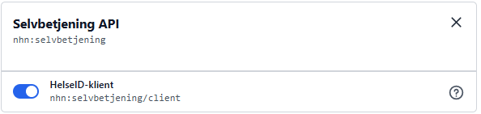

# Test scenario

## Generate keys

> Note in order to run the steps below you must set correct output folder and version number on the package


### 1. Create nuget packages of Fhi.Security.Cryptography.CLI

```
dotnet pack ./Fhi.Security/src/Fhi.Security.Cryptography.CLI/Fhi.Security.Cryptography.CLI.csproj --configuration Release -p:PackageVersion=1.0.0-beta2 --output C:\Users\jhoug\source\repos\nuget 
 ```

### 2. Install the package in a new console app

```bash

dotnet tool install --global  Fhi.Security.Cryptography.CLI --version 1.0.0-beta2 --add-source C:\Users\jhoug\source\repos\nuget

```

### 3. Run the tool to verify it works

Create JWK:

```bash

fhi-cryptography generatejsonwebkey --KeyFileNamePrefix prefixname --KeyDirectory C:\temp\jwk --KeyCustomKid customKidId

```

Create Certificate:

```bash

fhi-cryptography generatecertificate --CertificateCommonName Fhi.Grunndata --CertificatePassword Password123! --CertificateDirectory C:\temp\cert

```


## Update HelseID secrets

### 1. Create nuget packages of Fhi.HelseIDSelvbetjening.CLI

```
dotnet pack ./Fhi.HelseId/src/Fhi.HelseIDSelvbetjening.CLI/Fhi.HelseIDSelvbetjening.CLI.csproj --configuration Release -p:PackageVersion=1.0.0-beta2 --output C:\Users\jhoug\source\repos\nuget 
 ```

### 2. Install the package in a new console app

```bash

dotnet tool install --global  Fhi.HelseIDSelvbetjening.CLI --version 1.0.0-beta2 --add-source C:\Users\jhoug\source\repos\nuget

```

### 3. Run the tool to verify it works

#### 3a. Add scope to HelseId client

Add the scope `nhn:selvbetjening/client` to the client in HelseId




#### 3b Read client secret

See powershell sample in `Samples\read-clientsecret.ps1`

#### 3c Update client secret

See powershell sample in `Samples\update-clientsecret.ps1`


