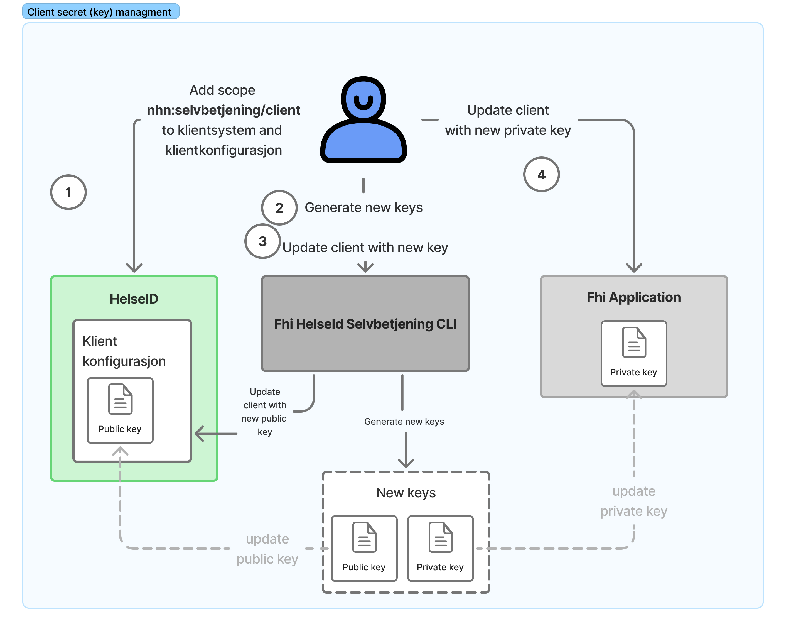

# HelseId Client secrets Tool

Client Secret Tool is a console application that facilitates the secure rotation of client secrets for applications integrated with Helse ID. A user initiates a request to upgrade/rotate the client secret for an application through the tools console interface. The tool provides commands for:

- **Update client keys in HelseID client configuration:** Command for updating secrets (public key) on a HelseID client. See [overview of update client secret commands](./commands/client-secret-update-commands.md)
- **Read client secret expiration:** Command for reading the expiration date of client secrets to enable automated monitoring and renewal scheduling. See [overview of read client secret expiration commands](./commands/read-client-secret-expiration-command.md)

## Authentication 
The Client Secret Tool authenticates with Helse ID using the uses the client's existing private JWK (JSON Web Key) and client ID to verify its identity to get an access token.

## Updating client secret flow

The image below illustrates the steps for updating a client keys (secrets)

1. **Update klientkonfiguration scope:** The client must have registered the _nhn:selvbetjening/client_ scope in order for an application to use the tool. The scope _nhn:selvbetjening/client_ to klientsystem must be added to the client system and klientkonfigurasjon.
1. **Update client with public key:** The HelseId client should be updated with the newly generated keys. This is done with the command `updateclientkey`.
1. **Update application with private key**: The application configuration must be updated with the new private key for seamless integration with the updated client.